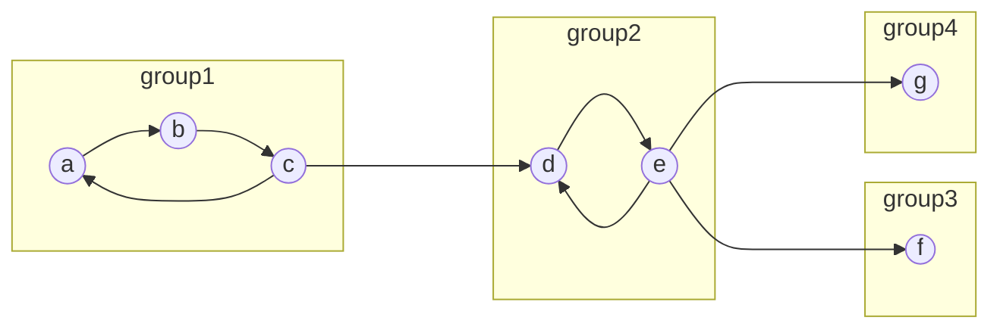
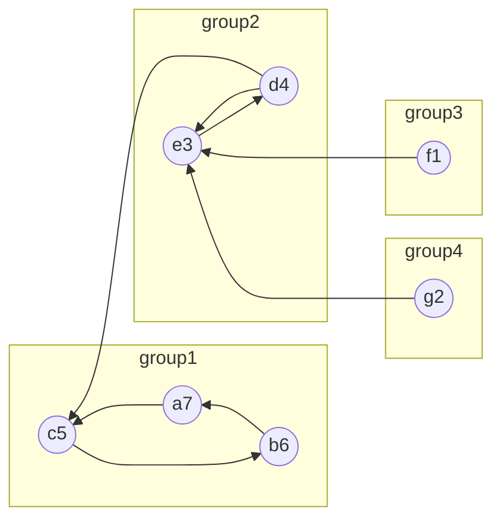

## 概要

有向グラフにおいて「互いに行き来できる ⇔ 同じグループ」を満たすように頂点をグループ分けすることを __強連結成分分解(SCC, Strongly Connected Component)__ と呼ぶ。  
例えば下記のような場合の強連結成分分解は $\{a, b, c\}, \{d, e\}, \{f\}, \{g\}$ となる。



## アルゴリズム

基本的にはDFSを2回行うだけ。そのため計算量はDFSと同様に $O(\lvert V \rvert + \lvert E \rvert)$ になる

1. 適当な頂点から **深さ優先探索(DFS)** を行う。その際に各頂点$v$に対して頂点$v$から進めなくなった順番$t(v)$を格納する。(**帰りがけ順で各頂点に番号を振る**)  
   1度で全頂点を訪れない場合は、また別の頂点からスタートしてまだ訪れていない頂点のみをDFSする。
2. グラフの辺の向きをすべて逆にしたものに対して深さ優先探索を行う。その際$t(v)$が大きい頂点からスタートする。行き止まったところまでを1つの連結成分とする。

概要記載の図では下記のようになる。

1. 適当な頂点$a$から深さ優先探索を行う。この時 $a \rightarrow b \rightarrow c \rightarrow d \rightarrow e \rightarrow f$ まで探索する。$f$ から先には進めないので $t(f)=1$ とする。次に $e$ に戻り、$g$ へと進む。$g$ より先には進めないので $t(g) = 2$。$e$ に戻り、未探索点に進めないので $t(e)=3$ になる。以下同様。
2. 次に辺の向きをすべて逆にした有効グラフに対して深さ優先探索を行う。最も $t(v)$ が大きくなる $a$ からスタートする。この時 $a \rightarrow c \rightarrow b$ と進んで行き止まるので $\{a, b, c\}$ が一つの連結成分となる。残った頂点の中で $t(v)$ が最も大きいものから同様の処理を繰り返す。



## 実装例

```Python
from collections import defaultdict, deque

V = [1, 2, 3, 4, 5, 6, 7, 8, 9]
E = [
	 (1, 2), (2, 7), (7, 1), (3, 8), (8, 3), 
	 (4, 2), (4, 6), (6, 9), (9, 5), (5, 4)
	]

G = defaultdict(set)
rev_G = defaultdict(set)
for f, t in E:
    G[f].add(t)
    rev_G[t].add(f)


# 手順1
# DFSで各頂点に帰りがけ順で番号を振る
visited = set()
numbers = []
for s in V:
    if s in visited:
        continue
    
    q = deque()
    q.append(s)
    while q:
        v = q.pop()

        if v < 0:
            numbers.append(-v)
            continue

        if v in visited:
            continue

        visited.add(v)
        q.append(-v)
        for vv in G[v]:
            if vv not in visited:
                q.append(vv)

numbers.reverse()

# 手順2
# 辺の向きをすべて反転したグラフで番号の大きい順でDFSを行う。
U = []
visited = set()
for s in numbers:
    if s in visited:
        continue

    visited.add(s)

    q = deque()
    q.append(s)
    u = set()
    while q:
        v = q.pop()
        u.add(v)

        for vv in rev_G[v]:
            if vv not in visited:
                q.append(vv)
                visited.add(vv)

    U.append(u)

print(U)  # => [{9, 4, 5, 6}, {1, 2, 7}, {8, 3}]
```

## 参考

- [強連結成分分解の意味とアルゴリズム | 高校数学の美しい物語](https://manabitimes.jp/math/1250)
