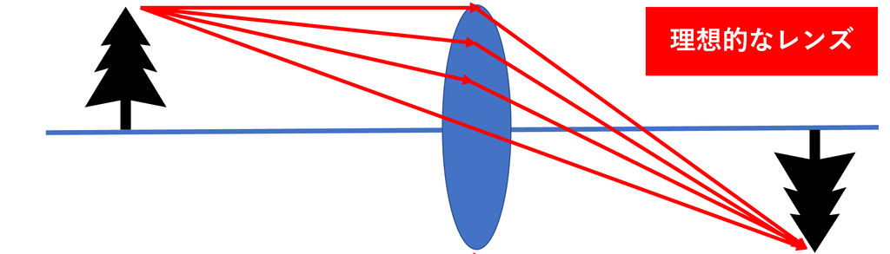
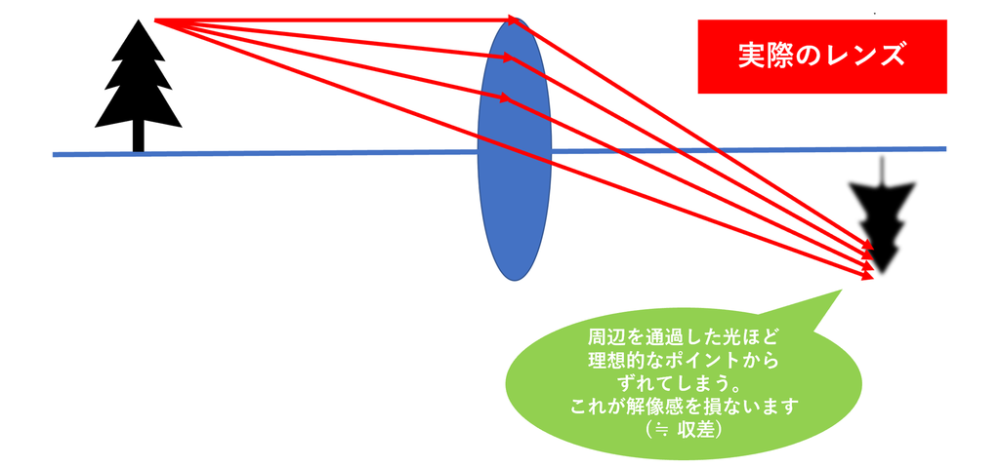
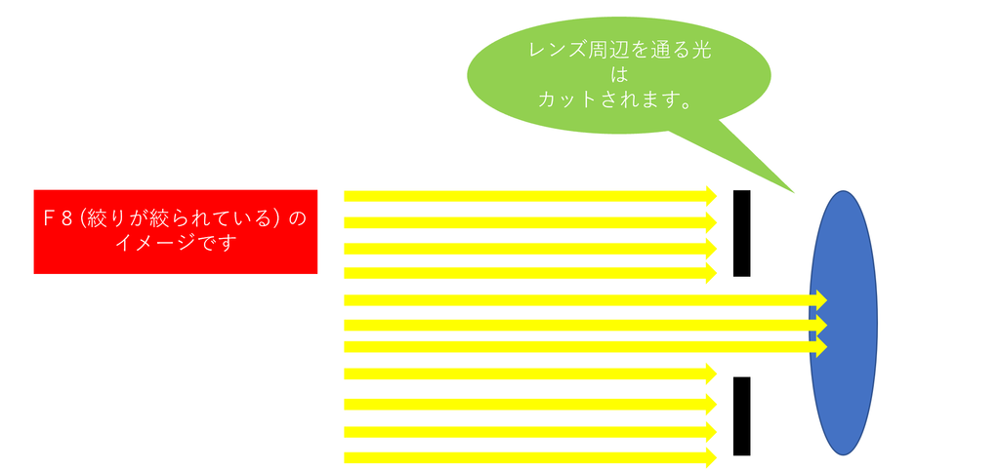
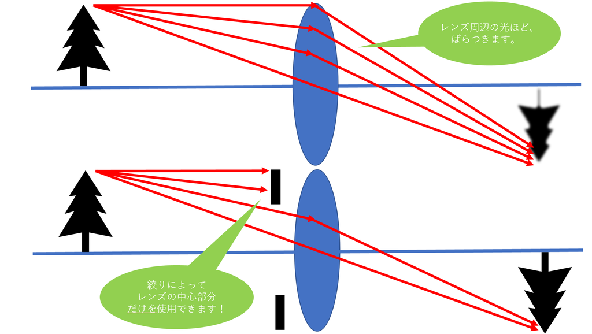

---
tags:
  - article
  - 写真
  - カメラ
  - レンズ光学
source: https://tatsumo77.hatenablog.com/entry/2018/11/18/184642
created: 2026-03-10 Tue 19:34
updated: 2026-03-10 Tue 19:39
---

## 概要

絞ることで画質が改善する理由は主に2つ：

1. **レンズの中心（良質な部分）だけを使用できるから**
2. **口径食の影響を受けなくなるから**

## 理由①: レンズ中心部の使用（収差の低減）

絞ると周辺の光がカットされ、レンズの中心部分だけが使われる。

**なぜ中心部の方が良いのか？**

実際のレンズでは、**周辺を通過する光ほど理想的なポイントに像を結んでくれない**。これをレンズの収差（aberration）という。

| レンズ | 特性 |
|--------|------|
| 理想的なレンズ | 全ての光が一点に集まる |
| 実際のレンズ | 周辺を通過した光ほどズレる（≒収差） |

絞ると周辺光がカットされ、良質な中心部だけが使われる：

## 理由②: 口径食の低減

**口径食（vignetting）** とは、絞りが開いているときにレンズの周辺に入ってくる光が円形ではなく楕円形になる現象。

- 絞りが開放（例: F1.4）の場合、斜めから見ると円形でなく光がきちんと入ってこない
- 絞ると口径食が改善され、周辺の画質が安定する

出典: [カメラの豆知識 ～絞りを絞ると画質向上したり、ピントが広い範囲に合う理由～](https://tatsumo77.hatenablog.com/entry/2018/11/18/184642)

## 実例: F2.8 vs F8 の画質比較

F2.8では以下の問題が目立つ：
- 点光源の崩れ
- パープルフリンジ
- 解像感の低下

これらはレンズを通過した光が一点に集まらないこと（収差）や口径食の影響による。

## まとめ

絞ることで画質が改善する理由：
- 絞ることでレンズの**良質な中心部だけを使用**できる（収差の低減）
- **口径食の影響が減少**し、周辺の画質が安定する

## 関連記事

- [[F値と絞りの基本]]
- [[被写界深度とF値の関係]]
- [[回折現象と小絞りボケ]]

引用元: [カメラの豆知識 ～絞りを絞ると画質向上したり、ピントが広い範囲に合う理由～](https://tatsumo77.hatenablog.com/entry/2018/11/18/184642)
